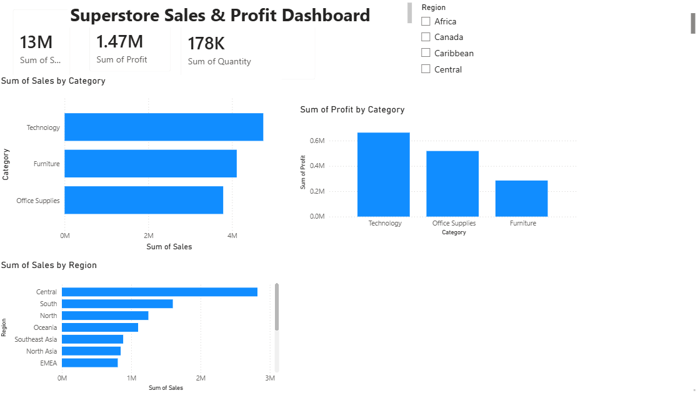
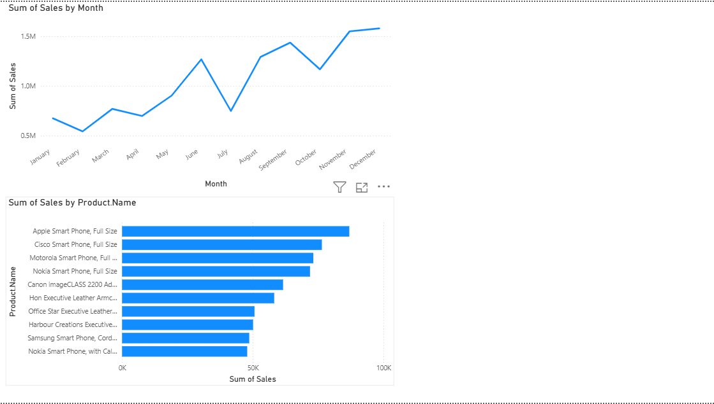
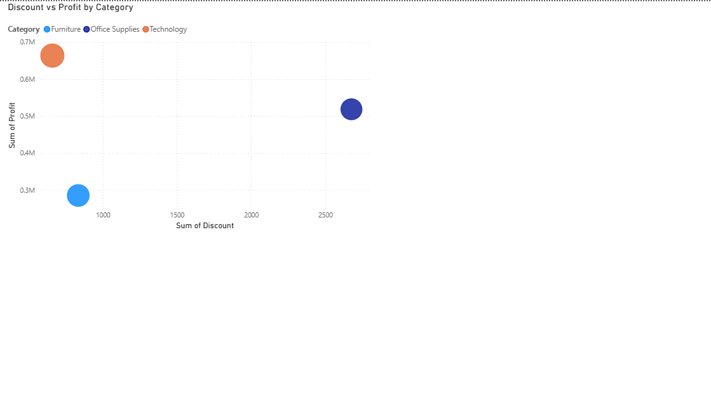

# Superstore Sales Analytics Dashboard

An end-to-end **E-Commerce Sales Analytics project** built using Python, SQL, MySQL, and Power BI to analyze sales performance, profitability, customer behavior, product performance, regional trends, and discount impact.

---

## 🚀 Project Overview

This project analyzes a Superstore dataset to generate actionable business insights and demonstrate an end-to-end data analytics workflow.

The project answers key business questions such as:

- Which regions generate the highest sales and profit?
- Which categories and sub-categories perform best?
- Which products generate the highest profit or losses?
- How do discounts affect profitability?
- Which customer segments contribute the most revenue?
- How do sales and profit change over time?
- Which shipping modes are most frequently used?

**Python and Pandas** were used for data cleaning and analysis, **SQL and MySQL** for business-focused querying, and **Power BI with DAX** for interactive dashboard development.

---

## 🛠️ Tech Stack

| Technology | Purpose |
|---|---|
| Python | Data analysis and preprocessing |
| Pandas | Data cleaning and manipulation |
| SQL | Business analysis and querying |
| MySQL | Data storage and SQL analysis |
| Power BI | Interactive dashboard and visualization |
| DAX | KPI calculations and measures |
| Git & GitHub | Version control and project management |

---

## 📈 Power BI Dashboard

The Power BI dashboard provides an interactive view of:

- Sales performance
- Profitability
- Regional performance
- Category and sub-category analysis
- Customer segmentation
- Product performance
- Discount analysis
- Monthly sales and profit trends
- Shipping mode performance

### Dashboard Overview



### Sales Analysis



### Profit Analysis



---

## 💡 Key Business Insights

- **$12.64M total sales** and **$1.47M total profit** were generated across **25,035 orders** and **4,873 customers**, with an overall **11.61% profit margin**.
- **Central region** was the highest-performing region, generating **$2.82M in sales** and **$311.40K in profit**.
- **Technology** was the top-performing category, contributing **$4.74M in sales** and **$663.78K in profit**.
- **Copiers** generated the highest sub-category profit of approximately **$258.57K**, while **Tables** generated a loss of approximately **$64.08K**.
- **Consumer** was the largest customer segment, contributing approximately **$6.51M in sales** and **$749.24K in profit**.
- **Apple Smart Phone, Full Size** was the highest-selling product with approximately **$86.94K in sales**.
- **Canon imageCLASS 2200 Advanced Copier** generated the highest product-level profit of approximately **$25.20K**.
- **Cubify CubeX 3D Printer Double Head Print** was the largest loss-making product, generating approximately **$8.88K in negative profit**.
- Higher discount levels were generally associated with lower or negative profitability, with **40%, 50%, 60%, and 70% discounts** showing substantial negative profit.
- **Standard Class** was the most frequently used shipping mode, accounting for **15,154 orders**, with approximately **$7.58M in sales** and **$890.60K in profit**.
- Monthly sales reached a peak of approximately **$555.31K in November 2014**.

These insights help identify profitable markets, high-value customer segments, strong product categories, loss-making products, and potential discount-related profitability risks.

---

## 🗄️ SQL Analysis

SQL was used to perform business-focused analysis including:

- Regional sales and profit analysis
- Category and sub-category performance
- Top-selling products
- Loss-making products
- Discount impact analysis
- Monthly sales trends
- Shipping mode analysis
- Customer segment analysis
- Customer performance
- Regional profitability

### Example SQL Query

```sql
SELECT
    Region,
    SUM(Sales) AS Total_Sales,
    SUM(Profit) AS Total_Profit
FROM superstore
GROUP BY Region
ORDER BY Total_Sales DESC;
### SQL Concepts Used

* SELECT and filtering
* WHERE conditions
* GROUP BY
* HAVING
* ORDER BY
* Aggregate functions
* CASE statements
* JOINs
* Subqueries
* Date functions

---

## 🐍 Python Analysis

Python and Pandas were used to perform data preparation, validation, exploratory analysis, and KPI calculations.

Key activities included:

* Data loading and preprocessing
* Column and data-type validation
* Missing-value analysis
* Duplicate and data-quality checks
* Exploratory data analysis
* Sales and profit calculations
* Regional and category analysis
* Customer and product analysis
* Discount analysis
* Monthly sales and profit trend analysis
* Business insight generation

The Python analysis generated a business summary report containing key KPIs and analytical findings used to support the Power BI dashboard.

---

## 📊 Key KPIs

The dashboard tracks the following business KPIs:

| KPI                 |   Value |
| ------------------- | ------: |
| Total Sales         | $12.64M |
| Total Profit        |  $1.47M |
| Total Orders        |  25,035 |
| Total Customers     |   4,873 |
| Total Quantity      | 178,312 |
| Profit Margin       |  11.61% |
| Average Order Value | $505.01 |

---

## 📁 Project Structure

```text
E-Commerce-Sales-Analytics/
│
├── data/
│   └── superstore.csv
│
├── python/
│   └── analysis.py
│
├── SQL/
│   └── ecommerce_analysis.sql
│
├── dashboard/
│   └── Superstore_Dashboard.pbix
│
├── screenshots/
│   ├── dashboard_overview.png
│   ├── sales_analysis.png
│   └── profit_analysis.png
│
├── report/
│   └── business_summary.csv
│
└── README.md
```

---

## 🎯 Project Objective

The objective of this project is to demonstrate an end-to-end data analytics workflow, from raw data preparation and SQL-based business analysis to interactive Power BI dashboard development.

The project demonstrates how data can be transformed into meaningful business insights using Python, SQL, MySQL, Power BI, and DAX.

---

## 📌 Skills Demonstrated

* Data Cleaning & Preprocessing
* Exploratory Data Analysis
* Python & Pandas
* SQL Business Analysis
* MySQL
* Power BI Dashboard Development
* DAX Measures
* KPI Development
* Data Visualization
* Business Intelligence
* Git & GitHub

---

## 👨‍💻 Author

**Prince Anand**

**Data Analyst | Python | SQL | Power BI | Excel**

* GitHub: [351Prince](https://github.com/351Prince)
* LinkedIn: [Prince Anand](https://www.linkedin.com/in/prince-anand-b32414258/)

---

⭐ If you found this project useful, feel free to explore the repository and connect with me on LinkedIn.
